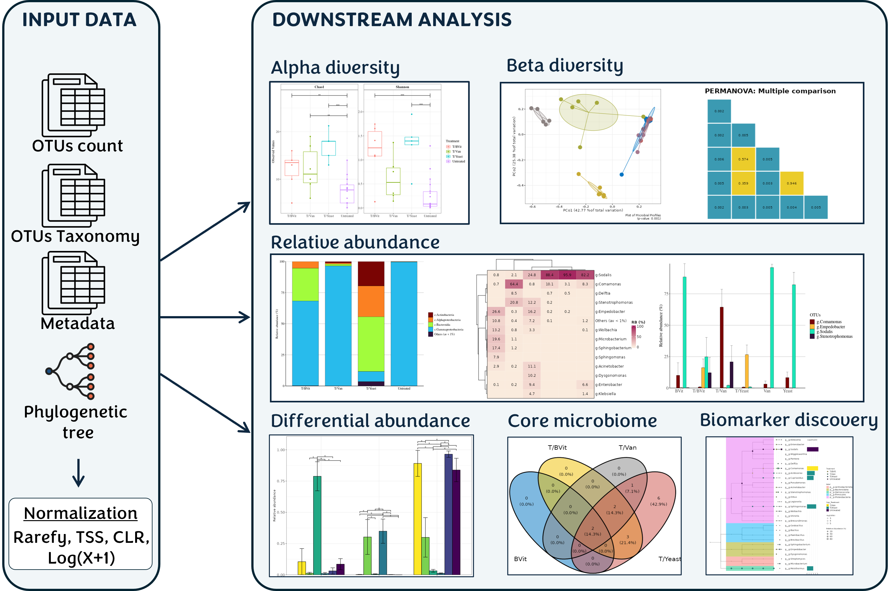

# MetaXplore

## Overview
MetaXplore, an interactive, user-friendly platform that enables the discovery and visualization of amplicon sequencing data. Currently, it provides a set of well-documented choices for downstream analysis, including alpha and beta di-versity analysis, taxonomic composition, differential abundance analysis, identification of the core microbiome within a population and biomarker analysis. These features are presented in a user-friendly format that facilitates easy customization and the generation of publication-quality graphics. MetaXplore is implemented entirely in the R language using the Shiny framework. It can be easily used locally on any system with R installed, including Windows, Mac OS, and most Linux distributions, or remotely through a web server (<a href="http://metaxplore.eu">here</a>) <b>without bioinformatic expertise. It can also be used as a framework for advanced users who can modify and expand the tool.</b>

<b>You can easily access MetaXplore here: http://metaxplore.eu</b>

  
 

## Description of the content
**Folders:
 - "analysis_functions": Contains the main functions of the downstream analysis (relative abundance, Alpha diversity, ....)
 - "server_functions": Contains the server logic required for the analysis sections
 - "www": Contains the guide sections in HTML format and the example files

 **Files:
 - server.R: contains the server function definition, it is require the files saved in "server_functions" folder
 - ui.R: contains the user interface definition
 - tools_functions: contains six extra functions needed during the analysis

## Deployment (tested by me under freshly installed Ubuntu 24.04 LTS under Windows 11 WSL)
I tested these deployment tricks under freshly installed Ubuntu 24.04 LTS under Windows 11 WSL, but it should be running under the original Ubuntu 24.04 LTS.

**Requirements

Make sure you have these software installed
 - R (version 4.3.3), installed by sudo apt-get install r-base
 - R devtools (version 2.4.5), installed by sudo apt-get install r-cran-devtools
 - Python (version 3.12.3) and pip (version 24.0), installed by sudo apt-get install python3 and sudo apt-get install python3-pip respectively
 - Shiny-server, you can use that provided by Canonical at their Ubuntu package repository (version 1.5.20.1002) by using sudo apt-get install shiny-server or that provided by Posit (version 1.5.22.1017) which you can see at <a href="https://posit.co/download/shiny-server/">here</a> for the detailed installation instruction.

**Essential Ubuntu packages

Install these packages using sudo apt-get:

sudo apt-get install build-essential libc6 libc-bin libc-dev-bin libc-devtools libc6 libc6-dev cmake libcurl4-openssl-dev libfontconfig1-dev libudunits2-dev libcairo2-dev libmagick++-dev libharfbuzz-dev libfribidi-dev libfreetype6-dev libpng-dev libtiff5-dev libjpeg-dev libtirpc-dev libnetcdf-c++4-dev libnetcdf-dev libnetcdf-mpi-dev libnetcdff-dev libpnetcdf-dev libnetcdf-pnetcdf-dev libgdal-dev

These packages are Node.js modules required by Shiny:

sudo apt-get install libjs-moment mocha node-accepts node-ansi-colors node-array-flatten node-array-from node-bash node-basic-auth node-body-parser node-browser-stdout node-bytes node-client-sessions node-compressible node-compression node-content-disposition node-content-type node-cookie node-cookie-signature node-cookies node-d node-encodeurl node-es5-ext node-es6-iterator node-es6-symbol node-escape-html node-etag node-event-emitter node-eventemitter3 node-eventsource node-express node-faye-websocket node-finalhandler node-follow-redirects node-fresh node-fs-extra node-he node-http-errors node-http-proxy node-ip-address node-ipaddr.js node-is-object node-jsbn node-jsonfile node-keygrip node-klaw node-log4js node-media-typer node-merge-descriptors node-methods node-moment node-morgan node-nan node-on-finished node-on-headers node-original node-parseurl node-path-to-regexp node-pause node-pinkyswear node-proxy-addr node-q node-qs node-querystringify node-range-parser node-raw-body node-requires-port node-send node-serve-static node-setprototypeof node-shiny-server-client node-should node-sinon node-sockjs node-sockjs-client node-split node-stable node-statuses node-toidentifier node-type-detect node-type-is node-underscore node-universalify node-unpipe node-url-parse node-utils-merge node-vary node-websocket-driver

**Rshiny-server-cmd

Rshiny-server-cmd is a Python script written by ideonate (see <a href="https://github.com/ideonate/rshiny-server-cmd">here</a> for information) as a command line wrapper to run a named R Shiny Server script/folder.

Install Rshiny-server-cmd by this command:

pip install rshiny-server-cmd --break-system-packages (using --break-system-packages to install it at system-level)

**Testing and deployment

If all packages and requirements are installed, please check your http://localhost:3838/ (default port where Shiny listened) in your browser to see the Shiny test page. If you see the Shiny test page, your Shiny installation is successful. 

To deploy MetaXplore, download and unpack the downloaded zip package to your desired folder (~/MetaXplore, for example).

I already made some little modifications to the scripts to prevent deployment errors due to unavailable packages lacking in the original script. All should be OK right now.

After being deployed run this command to start MetaXplore. You can change the port number to any free port number (not being used by other programs and surely not the same 3838 port used by the previous Shiny instance). In this case, I use 3839, so MetaXplore will be available at http://localhost:3839/. You also can change the folder where you deploy MetaXplore:

rshiny-server-cmd --port 3839 ~/MetaXplore/

If you encounter an error or fail to see anything because a library or some libraries are missing, open your terminal and call R using sudo (sudo R). In the R prompt, run the following command.

source("/where/is/the/MetaXplore/auto_install_load.R")

In this case run source("/home/user_name/MetaXplore/auto_install_load.R") (do not abbreviate /home/user_name into ~ in this command) and rerun MetaXplore by rshiny-server-cmd 

## Citation
Please cite the original research article written by the original authors of MetaXplore instead of this repository. I just modified it a bit and provided the deployment tricks.

Bel Mokhtar, N. et al. 2024. Development of MetaXplore: An Interactive Tool for Targeted Metagenomic Analysis. Current Issues in Molecular Biology. 46(5): 4803-4814. <a href="https://doi.org/10.3390/cimb46050289">doi:10.3390/cimb46050289</a>.

